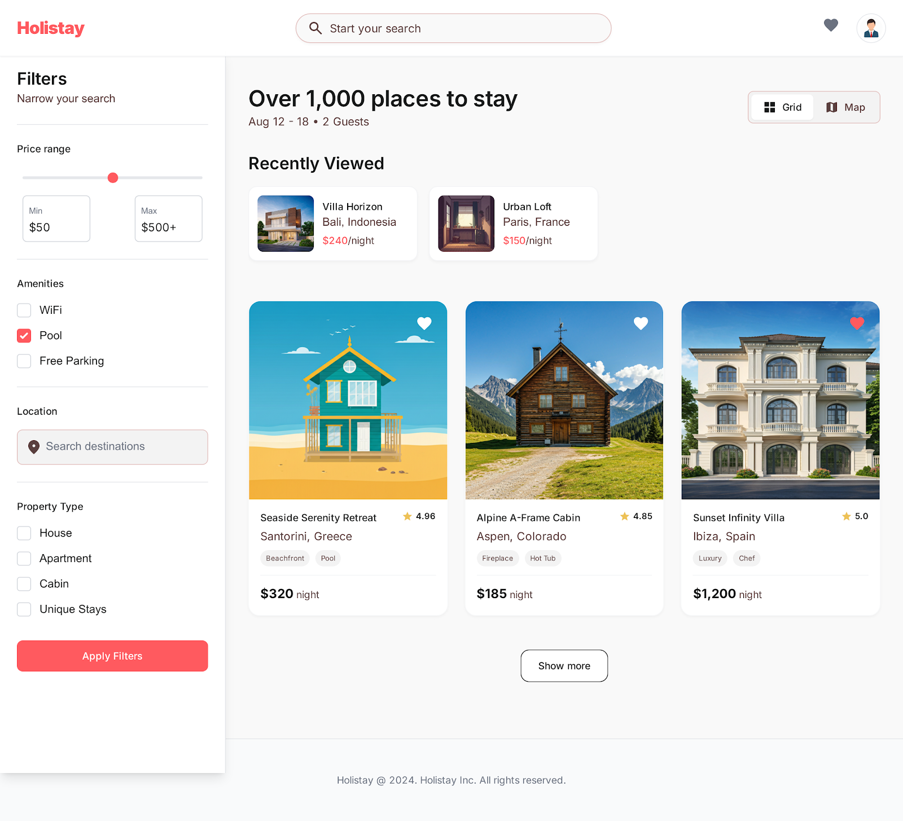

## Run Locally

**Prerequisites:**  Node.js

1. Install dependencies:
   `npm install`
2. Run the app:
   `npm run dev`

# Holistay

Holistay is a frontend-only booking app for Africa, inspired by Airbnb. It focuses on building a clean, responsive UI for browsing stays, filtering options, and simulating a booking experience.

## Overview

The goal of this project is to explore how a real-world product like a rental platform can be structured on the frontend, from listings and filters to user interactions like favorites and booking flow.

## Features

- Browse property listings  
- Filter by price, location, and amenities  
- Save and manage favorites (localStorage)  
- Recently viewed listings  
- Listing details view  
- Multi-step booking flow (UI only)  

## Tech

- React  
- JavaScript  
- Local state + custom hooks  

## Status

Frontend prototype (no backend or real data integration yet)

## Preview

Frontend Airbnb-style booking app for Africa, with filters, favorites, and a simulated booking flow.